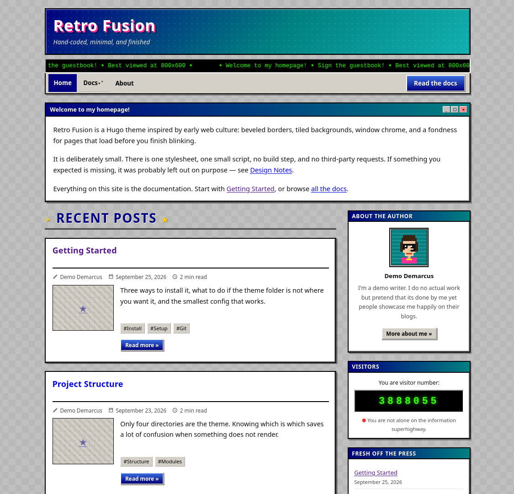
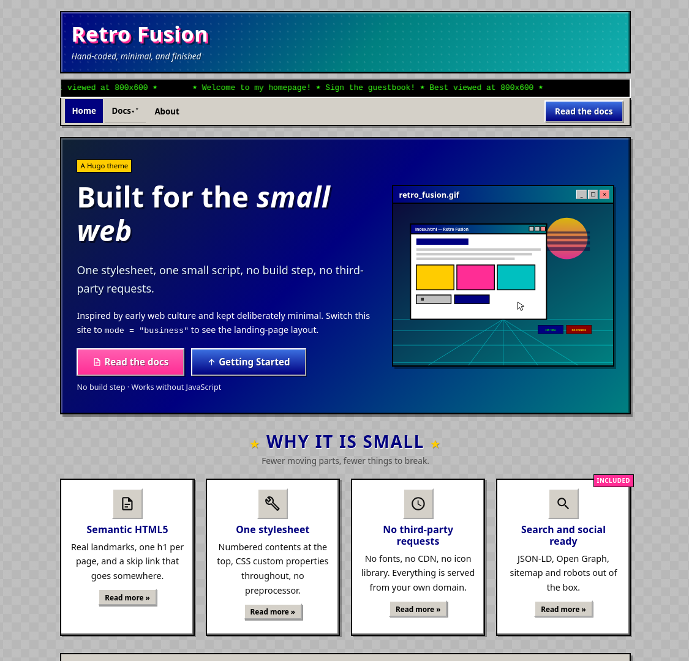
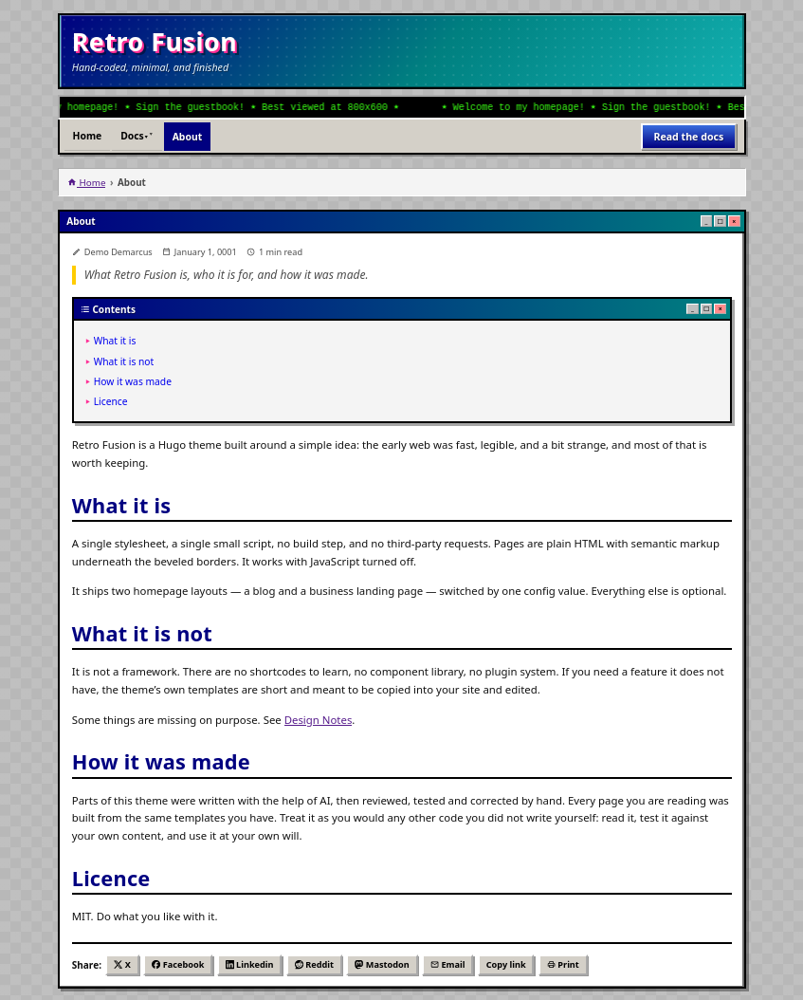
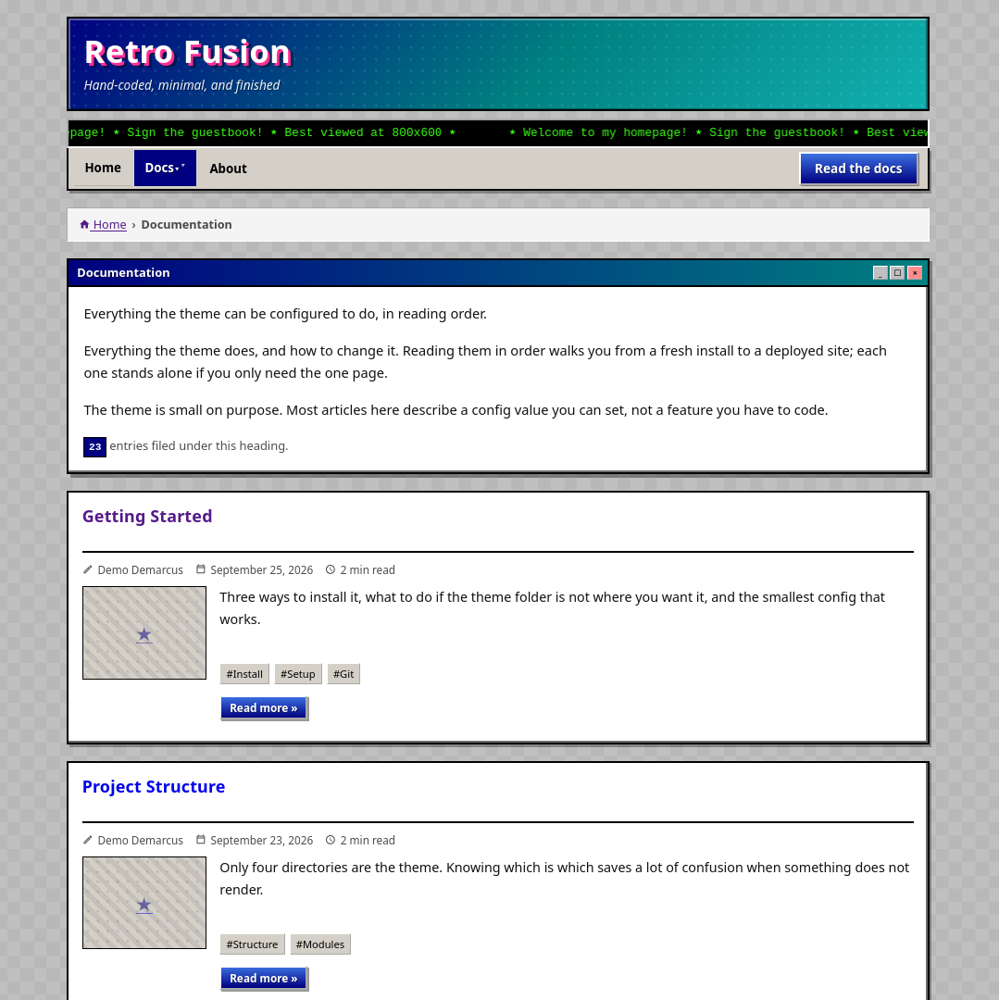

# Retro Fusion

Retro Fusion is a simple Hugo theme designed around the aesthetic of 2000s personal websites. Retro aesthetics, no bloat: a single stylesheet, a single script, no build step, and zero third-party requests.

> **Parts of this theme were written with the help of AI**, then reviewed,
> tested and corrected by hand. Read it, test it against your own content, and
> use it at your own will.

**[Live demo and full documentation →](https://retro-fusion.abhishkkumar.com/)**

---

## What it is

The early web was fast, legible and a bit strange. Retro Fusion keeps those
parts - beveled borders, tiled backgrounds, window chrome, high contrast and
leaves the rest behind. Underneath the retro look is semantic HTML5, CSS Grid
and fluid type, so it is a normal, accessible website that happens to look like
1996.

It ships two homepage layouts, switched by one config value: a blog and a
business landing page. Everything else is optional.

## Features

- **Dual homepage** - blog or business mode, one config value
- Beveled borders, window chrome, tiled backgrounds, retro buttons
- Configurable palette, textures and fonts - all CSS custom properties
- Multi-level dropdown menus, sticky navigation, breadcrumbs
- Hero, carousel, services grid, FAQ accordion, CTA band - reorderable
- Sticky sidebar: author, visitor counter, recent posts, categories, tags
- Table of contents, share buttons, prev/next, related posts
- Inline SVG icon set
- Google Analytics 4, Plausible, or your own snippet (commented-out by default)
- JSON-LD, Open Graph, sitemap and robots out of the box

## Screenshots

| | |
|---|---|
|  |  |
|  |  |


## Install

```bash
# copy it in
cp -r retro-fusion /path/to/your-site/themes/

# or as a submodule
git submodule add https://github.com/hellofuji/retro-fusion themes/retro-fusion
```

```toml
theme = "retro-fusion"
```

That is the whole install. There is no build step.

```

## Quick start

```toml
baseURL = "https://example.org/"
title   = "My Site"
theme   = "retro-fusion"

[params]
  mode = "blog"          # or "business"

[taxonomies]
  category = "categories"
  tag      = "tags"
```

```bash
hugo new content posts/hello.md
hugo server
```

Every other setting has a working default. The demo's `hugo.toml` is the full
reference, with every option present and commented. 

If you want, you simple copy the `exampleSite/hugo.toml` to the root of your hugo site.

## Documentation

The demo site *is* the documentation. It is built from the same templates you
get, and every article explains one part of the theme with the config to copy:

| | |
|---|---|
| [Getting Started](https://retro-fusion.abhishkkumar.com/posts/getting-started/) | Install, move it to your root, first post |
| [Project Structure](https://retro-fusion.abhishkkumar.com/posts/project-structure/) | What is in the box |
| [Where Your Config Lives](https://retro-fusion.abhishkkumar.com/posts/where-your-config-lives/) | `theme.toml` vs `hugo.toml` |
| [Blog and Business Mode](https://retro-fusion.abhishkkumar.com/posts/blog-mode-and-business-mode/) | The one-value switch |
| [The Business Homepage](https://retro-fusion.abhishkkumar.com/posts/building-the-business-homepage/) | Hero, carousel, services, FAQ |
| [Header, Logo and Navigation](https://retro-fusion.abhishkkumar.com/posts/header-logo-and-navigation/) | Banner, ticker, menus |
| [The Footer](https://retro-fusion.abhishkkumar.com/posts/the-footer/) | Columns, social, badges, copyright |
| [Sidebar Widgets](https://retro-fusion.abhishkkumar.com/posts/sidebar-widgets/) | Author, counter, tags |
| [Theming](https://retro-fusion.abhishkkumar.com/posts/theming/) | Colours, textures, fonts, overrides |
| [Post Cards and Lists](https://retro-fusion.abhishkkumar.com/posts/post-cards-and-lists/) | Columns, excerpts, thumbnails |
| [Content and Front Matter](https://retro-fusion.abhishkkumar.com/posts/content-and-front-matter/) | Every key, and multiple authors |
| [Taxonomies](https://retro-fusion.abhishkkumar.com/posts/taxonomies/) | Tags, categories, your own |
| [Icons](https://retro-fusion.abhishkkumar.com/posts/icons/) | The SVG set and how to extend it |
| [Analytics and Privacy](https://retro-fusion.abhishkkumar.com/posts/analytics-and-privacy/) | GA4, Plausible, off by default |
| [Search Engines and Social](https://retro-fusion.abhishkkumar.com/posts/search-engines-and-social/) | What is emitted for crawlers |
| [Deployment](https://retro-fusion.abhishkkumar.com/posts/deployment/) | Set your domain, build, publish |

## Minimal on purpose

If a feature you expected is missing, it was probably left out rather than
forgotten.

- **No shortcodes.** Nothing to learn beyond Markdown and front matter.
- **No comment system.** A blog without comments is a blog.
- **No contact form.** A form that silently drops submissions is worse than an
  email address.
- **No search.** It needs a service or a build-time index, which is more
  machinery than a small site justifies.
- **No cookie banner.** No cookies are set and no third-party requests are
  made, so there is nothing to consent to.
- **No dark mode toggle.** The palette is a config value. Set it to something
  dark and you have dark mode.

There is no page builder, no component library and no plugin system, and the
theme is not going to grow one. If you need something it does not have, copy
one of its templates into your own `layouts/` directory and change it.

MIT licensed. Do what you like with it.
